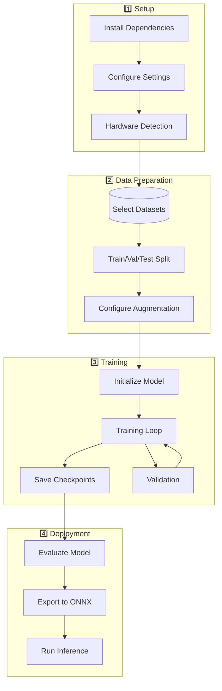

# Multi-Modal Neural Network - Training Guide

This guide provides instructions for training and using the multi-modal neural network.

## Training Overview



## Quick Start

### 1. Installation

First, install the required dependencies:

```bash
pip install -r requirements.txt
```

### 2. Configuration

The default configuration is in `configs/default.yaml`. You can modify it or create your own:

```bash
cp configs/default.yaml configs/my_config.yaml
# Edit my_config.yaml with your settings
```

### 3. Training

Start training with:

```bash
python train.py --config configs/default.yaml
```

Options:
- `--config`: Path to configuration file (default: `configs/default.yaml`)
- `--resume`: Path to checkpoint to resume training
- `--device`: Device to use (`cuda` or `cpu`)

Example with custom config:
```bash
python train.py --config configs/my_config.yaml --device cuda
```

### 4. Inference

Run inference on new data:

```bash
python inference.py \
  --config configs/default.yaml \
  --checkpoint checkpoints/best.safetensors \
  --image path/to/image.jpg \
  --text "Optional text description"
```

## Open Source Datasets

This section provides access information for popular open-source image and text datasets suitable for training multi-modal neural networks.

### Image-Text Paired Datasets

#### 1. MS COCO (Common Objects in Context)
**Best for:** General-purpose multi-modal learning, image captioning, object detection

- **Size:** 330K images, 1.5M captions
- **License:** Creative Commons Attribution 4.0
- **Download:**
  ```bash
  # Images
  wget http://images.cocodataset.org/zips/train2017.zip
  wget http://images.cocodataset.org/zips/val2017.zip
  wget http://images.cocodataset.org/zips/test2017.zip
  
  # Annotations
  wget http://images.cocodataset.org/annotations/annotations_trainval2017.zip
  wget http://images.cocodataset.org/annotations/image_info_test2017.zip
  ```
- **Website:** https://cocodataset.org/
- **API:** `pip install pycocotools`

#### 2. Flickr30k
**Best for:** Image captioning, visual question answering

- **Size:** 31K images, 158K captions (5 per image)
- **License:** Creative Commons (varies by image)
- **Access:** Request from https://shannon.cs.illinois.edu/DenotationGraph/
- **Alternative:** Available via Kaggle: https://www.kaggle.com/datasets/hsankesara/flickr-image-dataset

#### 3. Conceptual Captions
**Best for:** Large-scale image-text pretraining

- **Size:** 3.3M image-URL pairs with captions
- **License:** Creative Commons (various)
- **Download:**
  ```bash
  # Download TSV files
  wget https://storage.googleapis.com/gcc-data/Train/GCC-training.tsv
  wget https://storage.googleapis.com/gcc-data/Validation/GCC-1.1.0-Validation.tsv
  ```
- **Website:** https://ai.google.com/research/ConceptualCaptions/
- **Note:** Contains URLs; images must be downloaded separately

#### 4. Visual Genome
**Best for:** Dense image annotations, scene understanding, relationships

- **Size:** 108K images, 5.4M region descriptions, 1.7M QA pairs
- **License:** Creative Commons Attribution 4.0
- **Download:**
  ```bash
  # Using Kaggle API
  kaggle datasets download -d muhammadusmanamjad/visual-genome
  ```
- **Website:** https://visualgenome.org/
- **API:** `pip install visual-genome`

#### 5. SBU Captions Dataset
**Best for:** Large-scale diverse image-text pairs

- **Size:** 1M images with captions
- **License:** Various (from Flickr)
- **Access:** http://www.cs.virginia.edu/~vicente/sbucaptions/
- **Download:** Images via URLs in dataset

### Image-Only Datasets (for pretraining vision encoders)

#### 6. ImageNet-1K
**Best for:** Vision encoder pretraining, classification

- **Size:** 1.28M training images, 1000 classes
- **License:** Research/educational use
- **Access:** Requires registration at https://image-net.org/
- **Download (via Kaggle):**
  ```bash
  kaggle competitions download -c imagenet-object-localization-challenge
  ```

#### 7. ImageNet-21K
**Best for:** Large-scale vision pretraining

- **Size:** 14M images, 21,841 classes
- **License:** Research/educational use
- **Access:** https://image-net.org/download-images
- **Note:** Larger version of ImageNet for better pretraining

#### 8. LAION-400M / LAION-5B
**Best for:** Massive-scale CLIP-style pretraining

- **Size:** 400M / 5B image-text pairs
- **License:** Various Creative Commons
- **Download:**
  ```bash
  pip install img2dataset
  # Follow instructions at https://github.com/rom1504/img2dataset
  ```
- **Website:** https://laion.ai/blog/laion-400-open-dataset/
- **Note:** Extremely large; consider using subsets

#### 9. Open Images V7
**Best for:** Object detection, visual relationships

- **Size:** 9M images, 600 classes
- **License:** Creative Commons Attribution 4.0
- **Download:**
  ```bash
  # Using FiftyOne
  pip install fiftyone
  import fiftyone as fo
  import fiftyone.zoo as foz
  dataset = foz.load_zoo_dataset("open-images-v7")
  ```
- **Website:** https://storage.googleapis.com/openimages/web/index.html

### Text-Only Datasets (for pretraining text encoders)

#### 10. Wikipedia
**Best for:** General knowledge text pretraining

- **Size:** ~6M articles in English
- **License:** Creative Commons
- **Download:**
  ```bash
  pip install datasets
  from datasets import load_dataset
  dataset = load_dataset("wikipedia", "20220301.en")
  ```

#### 11. BookCorpus
**Best for:** Long-form text understanding

- **Size:** 11K books, 74M sentences
- **License:** Various
- **Access:** Via Hugging Face `datasets` library
- **Download:**
  ```bash
  from datasets import load_dataset
  dataset = load_dataset("bookcorpus")
  ```

#### 12. Common Crawl
**Best for:** Large-scale web text

- **Size:** Petabytes of web data
- **License:** Open (web crawl)
- **Access:** https://commoncrawl.org/
- **Preprocessed:** C4 dataset via Hugging Face

### Domain-Specific Datasets

#### 13. Medical: MIMIC-CXR
**Best for:** Medical image-report pairs

- **Size:** 377K chest X-rays, 227K reports
- **License:** PhysioNet Credentialed Health Data License
- **Access:** Requires credentialing at https://physionet.org/content/mimic-cxr/2.0.0/

#### 14. Scientific: arXiv Dataset
**Best for:** Scientific text and figures

- **Size:** 1.7M+ papers
- **License:** Various (check per paper)
- **Access:** https://www.kaggle.com/datasets/Cornell-University/arxiv
- **Download:**
  ```bash
  kaggle datasets download -d Cornell-University/arxiv
  ```

#### 15. E-commerce: Amazon Product Data
**Best for:** Product images and descriptions

- **Size:** Varies by category
- **License:** Research use
- **Access:** https://cseweb.ucsd.edu/~jmcauley/datasets/amazon_v2/

### Dataset Utilities

#### Hugging Face Datasets Library
```bash
pip install datasets
```

```python
from datasets import load_dataset

# Load COCO
coco = load_dataset("HuggingFaceM4/COCO", split="train")

# Load Flickr30k
flickr = load_dataset("nlphuji/flickr30k", split="test")

# Load Conceptual Captions
cc = load_dataset("google-research-datasets/conceptual_captions", split="train")
```

#### PyTorch Vision Datasets
```python
from torchvision.datasets import CocoDetection, ImageNet

# COCO
coco = CocoDetection(
    root='./data/coco/train2017',
    annFile='./data/coco/annotations/instances_train2017.json'
)

# ImageNet
imagenet = ImageNet(root='./data/imagenet', split='train')
```

### Dataset Preparation Scripts

#### Download COCO
```bash
#!/bin/bash
mkdir -p data/coco
cd data/coco

# Training images
wget http://images.cocodataset.org/zips/train2017.zip
unzip train2017.zip

# Validation images
wget http://images.cocodataset.org/zips/val2017.zip
unzip val2017.zip

# Annotations
wget http://images.cocodataset.org/annotations/annotations_trainval2017.zip
unzip annotations_trainval2017.zip

# Cleanup
rm *.zip
```

#### Download Conceptual Captions and Images
```python
import pandas as pd
import requests
from pathlib import Path
from tqdm import tqdm

# Download TSV
df = pd.read_csv(
    'https://storage.googleapis.com/gcc-data/Train/GCC-training.tsv',
    sep='\t',
    names=['caption', 'url']
)

# Download images
output_dir = Path('data/conceptual_captions')
output_dir.mkdir(exist_ok=True, parents=True)

for idx, row in tqdm(df.iterrows(), total=len(df)):
    try:
        response = requests.get(row['url'], timeout=5)
        if response.status_code == 200:
            img_path = output_dir / f"{idx}.jpg"
            with open(img_path, 'wb') as f:
                f.write(response.content)
    except Exception as e:
        print(f"Failed to download {row['url']}: {e}")
```

#### Verify Dataset Integrity
```python
from pathlib import Path
import json
from PIL import Image

def verify_coco_dataset(data_path):
    """Verify COCO dataset integrity."""
    data_path = Path(data_path)
    
    # Check directories
    assert (data_path / 'train2017').exists(), "Missing train2017"
    assert (data_path / 'val2017').exists(), "Missing val2017"
    assert (data_path / 'annotations').exists(), "Missing annotations"
    
    # Check annotations
    with open(data_path / 'annotations/captions_train2017.json') as f:
        captions = json.load(f)
        print(f"Found {len(captions['images'])} training images")
        print(f"Found {len(captions['annotations'])} training captions")
    
    # Verify some images can be loaded
    train_dir = data_path / 'train2017'
    images = list(train_dir.glob('*.jpg'))[:10]
    for img_path in images:
        img = Image.open(img_path)
        img.verify()
    
    print("✓ Dataset verification passed")

# Usage
verify_coco_dataset('data/coco')
```

### Dataset Configuration

Update your `configs/default.yaml` to use these datasets:

```yaml
data:
  # COCO Captions
  dataset: "coco_captions"
  train_annotations: "data/coco/annotations/captions_train2017.json"
  val_annotations: "data/coco/annotations/captions_val2017.json"
  images_dir: "data/coco"
  
  # ImageNet
  # dataset: "imagenet"
  # data_path: "data/imagenet"
  
  # Custom dataset
  # dataset: "custom"
  # train_annotations: "data/custom/train.json"
  # val_annotations: "data/custom/val.json"
  # images_dir: "data/custom/images"
  
  # Data loading
  batch_size: 32
  num_workers: 4
  image_size: 224
  
  # Augmentation
  augmentation:
    random_crop: true
    random_flip: true
    color_jitter: true
    normalize: true
```

### Data Loading Best Practices

1. **Use SSD/NVMe storage** for faster I/O
2. **Set num_workers=4-8** based on CPU cores
3. **Enable pin_memory** for GPU training
4. **Cache preprocessed data** when possible
5. **Use progressive loading** for large datasets

### Citation Guidelines

When using these datasets, please cite appropriately:

**COCO:**
```bibtex
@inproceedings{lin2014microsoft,
  title={Microsoft coco: Common objects in context},
  author={Lin, Tsung-Yi and Maire, Michael and Belongie, Serge and others},
  booktitle={ECCV},
  year={2014}
}
```

**ImageNet:**
```bibtex
@article{deng2009imagenet,
  title={Imagenet: A large-scale hierarchical image database},
  author={Deng, Jia and Dong, Wei and Socher, Richard and others},
  journal={CVPR},
  year={2009}
}
```

**Conceptual Captions:**
```bibtex
@inproceedings{sharma2018conceptual,
  title={Conceptual captions: A cleaned, hypernymed, image alt-text dataset},
  author={Sharma, Piyush and Ding, Nan and Goodman, Sebastian and Soricut, Radu},
  booktitle={ACL},
  year={2018}
}
```

## Model Architecture

The multi-modal neural network consists of:

1. **Vision Encoder** (`src/models/vision_encoder.py`)
   - Vision Transformer (ViT) architecture
   - Processes images into patch embeddings
   - Configurable depth and width

2. **Text Encoder** (`src/models/text_encoder.py`)
   - BERT-style transformer encoder
   - Processes text into token embeddings
   - Supports attention masking

3. **Fusion Layer** (`src/models/fusion_layer.py`)
   - Early fusion: Concatenate and process together
   - Late fusion: Process separately then combine
   - Cross-modal attention mechanisms

4. **Double-Loop Controller** (`src/models/double_loop_controller.py`)
   - Meta-learning for adaptive training
   - LSTM-based controller
   - Adjusts learning rate and architecture dynamically

5. **Task Heads** (`src/models/heads.py`)
   - Classification head
   - Regression head
   - Contrastive learning head
   - Multi-task head

## Configuration

### Model Configuration

```yaml
model:
  vision_encoder:
    type: "vit_small"
    patch_size: 16
    hidden_dim: 512
    num_layers: 12
    num_heads: 8
  
  text_encoder:
    type: "bert_small"
    hidden_dim: 512
    num_layers: 12
    num_heads: 8
  
  fusion:
    type: "early"  # or "late"
    hidden_dim: 512
    num_layers: 6
  
  double_loop:
    controller_type: "lstm"
    hidden_dim: 256
    update_frequency: 100
  
  heads:
    type: "classification"
    num_classes: 1000
```

### Training Configuration

```yaml
training:
  max_epochs: 50
  inner_lr: 3e-4
  micro_batch_size: 4
  gradient_accumulation: 8
  optimizer: "adamw"
  scheduler: "cosine"
  weight_decay: 0.01
  max_grad_norm: 1.0
  mixed_precision: "bf16"
  gradient_checkpointing: true
```

### Data Configuration

```yaml
data:
  train_dataset: "coco_captions"  # or "imagenet"
  val_dataset: "coco_captions"
  data_path: "./data/coco"
  batch_size: 32
  num_workers: 4
```

## Usage Examples

### Basic Training

```python
from src.training import Trainer

trainer = Trainer(config_path="configs/default.yaml")
trainer.train()
```

### Custom Model Creation

```python
from src.models import create_multi_modal_model
from src.utils.config import load_config
import torch

# Load config
config = load_config("configs/default.yaml")

# Create model
model = create_multi_modal_model(config)
model.to('cuda')

# Forward pass
images = torch.randn(4, 3, 224, 224).cuda()
input_ids = torch.randint(0, 30522, (4, 512)).cuda()
attention_mask = torch.ones(4, 512).cuda()

outputs = model(
    images=images,
    input_ids=input_ids,
    attention_mask=attention_mask
)

logits = outputs['logits']
print(f"Output shape: {logits.shape}")
```

### Using Individual Components

```python
from src.models import VisionEncoder, TextEncoder, FusionLayer
import torch

# Create encoders
vision_config = {
    'img_size': 224,
    'patch_size': 16,
    'hidden_dim': 512,
    'num_layers': 12,
    'num_heads': 8
}
vision_encoder = VisionEncoder(**vision_config)

text_config = {
    'vocab_size': 30522,
    'hidden_dim': 512,
    'num_layers': 12,
    'num_heads': 8
}
text_encoder = TextEncoder(**text_config)

# Process inputs
images = torch.randn(2, 3, 224, 224)
input_ids = torch.randint(0, 30522, (2, 128))

vision_cls, vision_features = vision_encoder(images)
text_cls, text_features = text_encoder(input_ids)

print(f"Vision CLS shape: {vision_cls.shape}")
print(f"Text CLS shape: {text_cls.shape}")
```

## Dataset Preparation

### COCO Captions

1. Download COCO dataset:
```bash
mkdir -p data/coco
cd data/coco
wget http://images.cocodataset.org/zips/train2017.zip
wget http://images.cocodataset.org/zips/val2017.zip
wget http://images.cocodataset.org/annotations/annotations_trainval2017.zip
unzip train2017.zip
unzip val2017.zip
unzip annotations_trainval2017.zip
```

2. Update config:
```yaml
data:
  train_dataset: "coco_captions"
  data_path: "./data/coco"
```

### Custom Dataset

Create a custom dataset by extending `MultiModalDataset`:

```python
from src.data import MultiModalDataset

class MyDataset(MultiModalDataset):
    def _load_annotations(self):
        # Load your annotations
        return [
            {
                'image_path': 'image1.jpg',
                'caption': 'Description',
                'label': 0
            },
            # ... more samples
        ]
```

## Checkpointing and Resuming

### Save Checkpoint

Checkpoints are automatically saved during training:
- `checkpoints/latest.pt` - Latest checkpoint
- `checkpoints/best.pt` - Best validation loss

### Resume Training

```bash
python train.py \
  --config configs/default.yaml \
  --resume checkpoints/latest.pt
```

### Load for Inference

```python
from src.models import create_multi_modal_model
from src.utils.config import load_config
from src.utils.safe_load import safe_load_checkpoint

config = load_config("configs/default.yaml")
model = create_multi_modal_model(config)

# Prefer loading a safetensors `model_state_dict` when available
checkpoint = safe_load_checkpoint("checkpoints/best.safetensors", map_location="cpu", expected_keys={"model_state_dict"})
model.load_state_dict(checkpoint['model_state_dict'])
model.eval()
```

## Monitoring Training

### Weights & Biases

Enable W&B logging in config:

```yaml
logging:
  use_wandb: true
  project: "multi-modal-net"
  experiment: "my_experiment"
```

### Local Logs

Training logs are saved to:
- `logs/training.log` - Full training log
- `logs/my_experiment_metrics.txt` - Metrics log

## Performance Tips

1. **Gradient Checkpointing**: Enable for large models
```yaml
training:
  gradient_checkpointing: true
```

2. **Mixed Precision**: Use bf16 or fp16
```yaml
training:
  mixed_precision: "bf16"
```

3. **Gradient Accumulation**: Increase effective batch size
```yaml
training:
  micro_batch_size: 4
  gradient_accumulation: 8  # Effective batch size: 32
```

4. **Multi-GPU**: Coming soon

## Development & Code Quality

### Type Safety

The codebase maintains complete type safety with comprehensive mypy integration. Before committing changes, always run type checking:

```bash
# Check all source files
mypy src/ --show-error-codes

# Check with cache for faster runs
mypy src/ --cache-dir /tmp/mypy_cache --show-error-codes

# Check specific module
mypy src/models/ --show-error-codes
```

**Type Safety Benefits:**
- Prevents runtime type errors through static analysis
- Provides better IDE support and autocomplete
- Serves as inline documentation for APIs
- Enables safer refactoring and maintenance

### Code Formatting

Maintain consistent code style using the provided tools:

```bash
# Format Python code
black src/ tests/

# Sort imports
isort src/ tests/

# Check style compliance
flake8 src/ tests/
```

### Testing

Run the test suite to ensure code quality:

```bash
# Run all tests (using make)
make test

# Run with coverage
make test-cov

# Run using pytest directly
pytest tests/

# Run with coverage report
pytest tests/ --cov=src --cov-report=html

# Run specific test file
pytest tests/test_trainer.py

# Run integration tests
pytest tests/test_integration.py -v
```

### Pre-commit Checks

The project uses pre-commit hooks for automated code quality checks:

```bash
# Install pre-commit hooks (one-time setup)
pip install pre-commit
pre-commit install

# Run all quality checks using make
make lint

# Or run manually
pre-commit run --all-files

# Type check
mypy src/ --show-error-codes

# Format and lint (using make)
make format

# Or manually
black src/ tests/
isort src/ tests/
ruff check src/ tests/
flake8 src/ tests/

# Security scan
bandit -r src/
```

### Continuous Integration

The project uses GitHub Actions for CI/CD:
- **Multi-version testing**: Tests run on Python 3.11, 3.12, and 3.13
- **Coverage reporting**: Automatic coverage reports on pull requests
- **Dependency caching**: Fast CI builds with pip cache
- **Pre-commit checks**: Automated linting and formatting

## Troubleshooting

### Out of Memory

- Reduce batch size
- Enable gradient checkpointing
- Use gradient accumulation
- Reduce model size (fewer layers/smaller hidden dim)

### Slow Training

- Increase num_workers for data loading
- Use pin_memory=true
- Enable mixed precision training
- Use faster storage (SSD)

### Poor Convergence

- Adjust learning rate
- Try different optimizer (AdamW vs SGD)
- Increase warmup steps
- Check data preprocessing

## Citation

If you use this code, please cite:

```bibtex
@software{multimodal_neural_net,
  title = {Multi-Modal Neural Network with Double-Loop Learning},
  year = {2024},
  license = {Apache-2.0}
}
```
